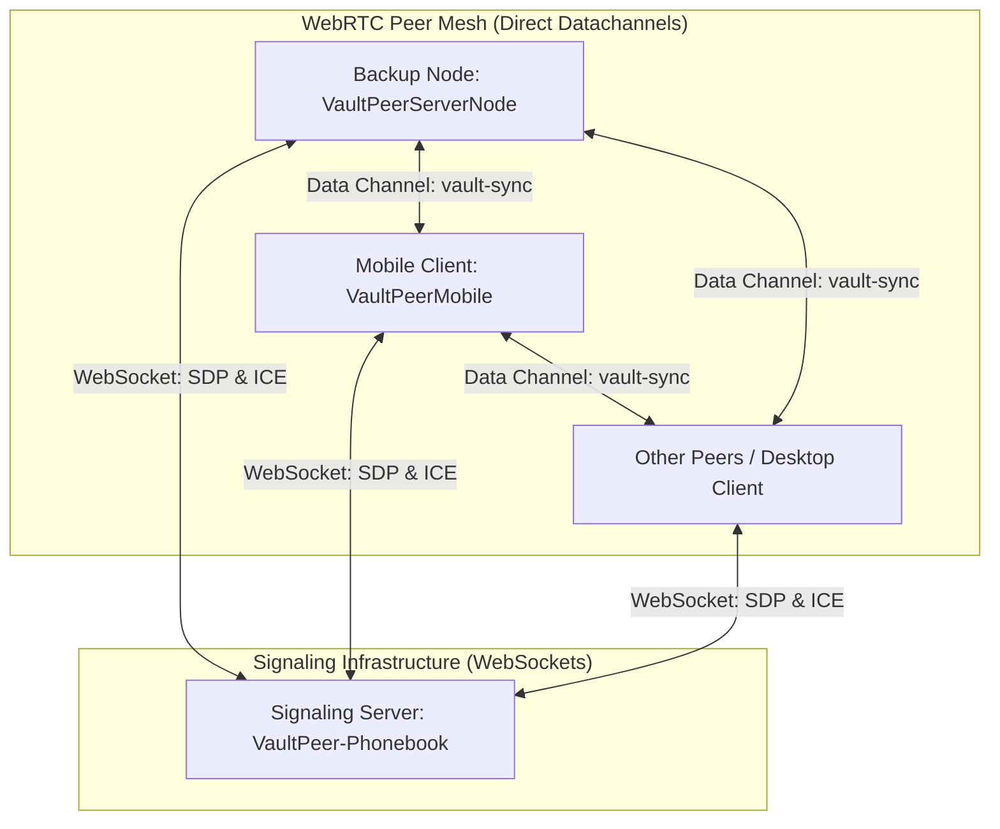
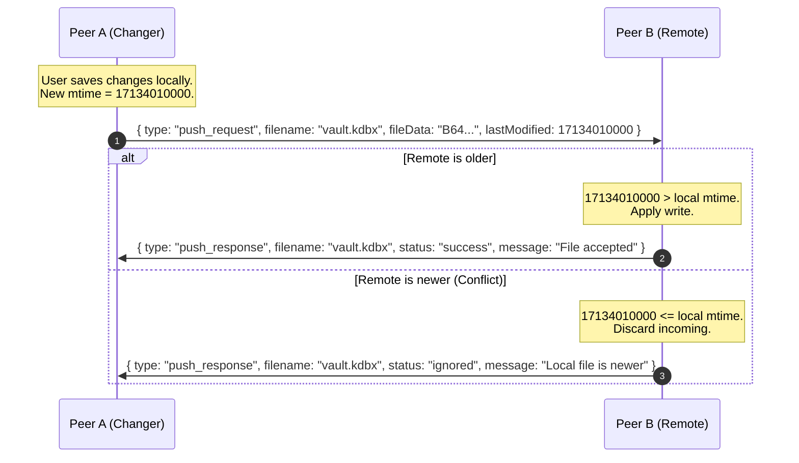

# VaultPeer WebRTC Synchronization Architecture & Protocol Specification

This document details the unified peer-to-peer WebRTC synchronization protocol for the **VaultPeer** network. It provides a blueprint for developers implementing syncing features across different nodes—such as the headless backup node (`VaultPeerServerNode`) and the React Native mobile app (`VaultPeerMobile`).

---

## 1. Network Topology Overview

VaultPeer uses a hybrid architecture combining a WebSocket-based signaling server with direct, peer-to-peer WebRTC data channels:

1. **Signaling Server (`VaultPeer-Phonebook`)**: A lightweight WebSocket server used only to coordinate rooms, exchange ICE candidates, and handle WebRTC offers/answers. It does _not_ persist database files and imposes a strict **50KB limit** on WebSocket payloads.
2. **Headless Backup Node (`VaultPeerServerNode`)**: A headless node (typically running in Docker) that connects to a room, stays online, and syncs encrypted KeePass (`.kdbx`) databases using WebRTC. It does _not_ possess the vault's master password; it handles files as raw binary data.
3. **Mobile Client (`VaultPeerMobile`)**: A React Native application that accesses the database locally, updates files on user edits, and connects to the same WebRTC room to synchronize changes.



---

## 2. Signaling & WebRTC Handshake Protocol

Because the signaling server simply forwards unrecognized JSON payloads to all clients in a room, peers must coordinate connection establishment using a **Politeness (Tie-Breaker) Protocol**.

### 2.1 Tie-Breaker Logic (Polite vs. Impolite Peers)

To prevent duplicate peer connections, role assignment is decided dynamically using a lexicographical comparison of client IDs (Node IDs):

- **Offerer (Impolite)**: The peer with the **greater** string ID (`myId > remoteId`). It is responsible for creating the `RTCPeerConnection`, opening the data channel, and sending the SDP `offer`.
- **Answerer (Polite)**: The peer with the **lesser** string ID (`myId < remoteId`). It waits for the offer, sets the remote description, and responds with an SDP `answer`.

### 2.2 The "Answerer Discovery" Race Condition (Crucial Fix)

When a new peer joins a room, it broadcasts an `announce` message. In the base design, existing peers receive this but only the Offerer acts. If the joining peer has a _larger_ ID than an existing peer, the existing peer (being the Answerer) does nothing, and the joining peer remains unaware of the existing peer since the existing peer's announce was sent before it joined.

**Requirement to guarantee 100% handshake rate:**

- When Peer A (Answerer) receives a `{ type: "announce" }` from Peer B (Offerer), Peer A must respond by sending its own `{ type: "announce" }` message back.
- This alerts Peer B to Peer A's existence, allowing Peer B (the Offerer) to initiate the connection.

### 2.3 Signaling Messages (WebSocket)

All signaling payloads are stringified JSON sent over the WebSocket.

#### 1. Join Room

Sent by a client immediately after opening the WebSocket connection.

```json
{
  "type": "join",
  "roomId": "vault-room-uuid"
}
```

#### 2. Announce Presence

Sent by a client to discover other peers in the room.

```json
{
  "type": "announce",
  "senderId": "node-unique-id"
}
```

#### 3. SDP Offer

Sent by the Offerer (impolite peer) to initiate WebRTC connection.

```json
{
  "type": "offer",
  "senderId": "node-unique-id",
  "targetId": "remote-peer-id",
  "sdp": "v=0\no=- 8031388... (raw SDP offer content)"
}
```

#### 4. SDP Answer

Sent by the Answerer (polite peer) responding to the offer.

```json
{
  "type": "answer",
  "senderId": "node-unique-id",
  "targetId": "remote-peer-id",
  "sdp": "v=0\no=- 2984102... (raw SDP answer content)"
}
```

#### 5. ICE Candidate

Sent by both peers as network routing paths are discovered.

```json
{
  "type": "candidate",
  "senderId": "node-unique-id",
  "targetId": "remote-peer-id",
  "candidate": "candidate:8421304 1 udp 16777215 ...",
  "mid": "0"
}
```

#### 6. Heartbeat (Ping/Pong)

The signaling server sends a ping every 30 seconds. Clients must respond to avoid termination.

```json
// Server -> Client
{ "type": "ping" }

// Client -> Server (Response)
{ "type": "pong" }
```

---

## 3. WebRTC Data Channel Sync Protocol

Once the WebRTC connection is established, the Offerer opens a single data channel with the label **`"vault-sync"`**. All subsequent database syncing messages flow directly peer-to-peer over this channel as stringified JSON.

### 3.1 Protocol Message Schema

| Message Type     | Sender   | Payload Fields                                                            | Description                                                                            |
| :--------------- | :------- | :------------------------------------------------------------------------ | :------------------------------------------------------------------------------------- |
| `metadata_query` | Any      | `type`                                                                    | Requests the other peer's file metadata for all files.                                 |
| `metadata_info`  | Any      | `type`, `filename`, `lastModified` (epoch ms), `size`                     | Advertises local file properties. Sent upon channel opening or in response to a query. |
| `pull_request`   | Receiver | `type`, `filename`                                                        | Requests the complete database content from the peer.                                  |
| `pull_response`  | Sender   | `type`, `filename`, `fileData` (Base64 string), `lastModified` (epoch ms) | Contains the base64-encoded file data and its logical modification timestamp.          |
| `push_request`   | Sender   | `type`, `filename`, `fileData` (Base64 string), `lastModified` (epoch ms) | Proactively sends a modified file to a peer (e.g. following a local save).             |
| `push_response`  | Receiver | `type`, `filename`, `status` (`"success"`/`"ignored"`), `message`         | Acknowledges a push. Returns `ignored` if the local copy is already newer.             |

---

### 3.2 Synchronization Flowcharts

#### A. Data Channel Establishment & Symmetric Sync (Startup/Reconnect)

Both sides exchange metadata when the channel opens. The side with the older file requests a pull.

```mermaid
sequenceDiagram
    autonumber
    participant A as Peer A (Local)
    participant B as Peer B (Remote)

    Note over A, B: Data Channel ("vault-sync") Opened
    A->>B: { type: "metadata_query" }
    A->>B: { type: "metadata_info", filename: "vault.kdbx", lastModified: 17134000000, size: 5420 }

    B->>A: { type: "metadata_info", filename: "vault.kdbx", lastModified: 17134005000, size: 5680 }

    Note over A: Peer B has a newer file (delta: +5000ms). Initiating pull.
    A->>B: { type: "pull_request", filename: "vault.kdbx" }
    B->>A: { type: "pull_response", filename: "vault.kdbx", fileData: "B64...", lastModified: 17134005000 }
    Note over A: Write file to storage; update local lastModified to 17134005000.
```

#### B. Proactive Sync (On Local File Modification)

When a user edits a database (e.g. adds/updates an entry in the mobile app), the changer immediately broadcasts a `push_request`.



---

## 4. Conflict Resolution & File Writing

VaultPeer implements a **Last-Write-Wins (LWW)** conflict resolution policy:

- Every file is associated with a logical modification timestamp in milliseconds since epoch (`lastModified`).
- An incoming file is **only** written to disk if `remoteLastModified > localLastModified`.
- All file writes **must be atomic** to prevent database corruption. Write content to a temporary sibling file (e.g., `vault.kdbx.tmp`) first, then rename/replace the target file.

---

## 5. Mobile-Specific (React Native) Implementation Strategy

Mobile environments introduce two significant challenges compared to daemon nodes:

1. **Document Providers / SAF (Storage Access Framework)**: Android's SAF and iOS's UIDocumentPicker act on content URIs and security-scoped URLs. Standard node filesystem tools like `fs.utimes` (to set mtime) are **not available** or won't work on cloud shares (Google Drive, iCloud).
2. **File System Watching**: Watching files dynamically with `chokidar` is not supported on mobile.

To overcome these, the mobile client must track modification times in app state.

### 5.1 Last Known Modification (LKM) Tracking

Instead of relying on the filesystem's physical modification dates, the mobile app must maintain a **Last Known Modification (LKM)** map in local storage (e.g., using `SecureStore` or a lightweight DB).

```typescript
// LKM Store Schema
interface LKMStore {
  [fileUri: string]: number; // file URI -> logical epoch millisecond timestamp
}
```

#### How LKM behaves during operations:

1. **Initial Vault Load**:
   - If the user selects a vault file and it has no entry in the LKM store, decrypt it and read the KeePass internal metadata: `db.meta.settingsChanged.getTime()`.
   - Store this timestamp as the initial LKM value for this URI.
2. **Incoming Sync Pull/Push (Apply Remote Write)**:
   - When a remote peer sends a newer file, write the file bytes natively (using the atomic write mechanism of `writeFile` in `VaultPeerFileSystem`).
   - Store the remote `lastModified` timestamp as the new local LKM value for the vault URI.
3. **Local Edit (User Saves Changes)**:
   - When the user modifies entries and saves the vault, serialize the database to base64.
   - Write the file content to the native URI.
   - Update the local LKM value to `Date.now()`.
   - Immediately broadcast a `push_request` to all connected WebRTC data channels with `lastModified: Date.now()`.
4. **Advertising Local Files**:
   - When a remote peer connects, read the LKM value for the active vault URI.
   - Send `metadata_info` using the LKM as `lastModified`.

---

## 6. Implementation Reference for Mobile Developers

### Recommended Dependencies

- **WebRTC**: [`react-native-webrtc`](https://github.com/react-native-webrtc/react-native-webrtc) (Provides native RTCPeerConnection and RTCDataChannel).
- **Base64**: [`react-native-quick-base64`](https://github.com/craftzdog/react-native-quick-base64) (For fast serialization).

### Code Walkthrough (Conceptual)

#### 1. Listening to WebRTC Data Channel Messages

```typescript
import { RTCPeerConnection, RTCDataChannel } from "react-native-webrtc";
import { useVaultStore } from "../stores/useVaultStore";
import { useFilePicker } from "../context/FilePickerContext";

function setupDataChannel(remotePeerId: string, channel: RTCDataChannel) {
  channel.onmessage = async (event) => {
    const msg = JSON.parse(event.data);
    const vaultStore = useVaultStore.getState();
    const filePicker = useFilePicker(); // Contains active fileUri and bookmark

    switch (msg.type) {
      case "metadata_query": {
        // Send our current LKM timestamp
        const localLkm = await getLkm(filePicker.fileUri);
        channel.send(
          JSON.stringify({
            type: "metadata_info",
            filename: "vault.kdbx",
            lastModified: localLkm,
            size: 0, // mobile can skip size estimation if hard to calculate
          })
        );
        break;
      }
      case "metadata_info": {
        const localLkm = await getLkm(filePicker.fileUri);
        if (msg.lastModified > localLkm) {
          // Request file
          channel.send(
            JSON.stringify({
              type: "pull_request",
              filename: msg.filename,
            })
          );
        }
        break;
      }
      case "pull_request": {
        // Read file bytes, encode in base64 and return
        const localLkm = await getLkm(filePicker.fileUri);
        const fileBase64 = await readFileNative(
          filePicker.fileUri,
          filePicker.bookmark
        );
        channel.send(
          JSON.stringify({
            type: "pull_response",
            filename: msg.filename,
            fileData: fileBase64,
            lastModified: localLkm,
          })
        );
        break;
      }
      case "pull_response":
      case "push_request": {
        const localLkm = await getLkm(filePicker.fileUri);
        if (msg.lastModified > localLkm) {
          // Atomic native write
          await writeFileNative(
            filePicker.fileUri,
            msg.fileData,
            filePicker.bookmark
          );
          // Update LKM in SecureStore
          await setLkm(filePicker.fileUri, msg.lastModified);
          // Reload the database in UI
          await vaultStore.refreshParsedState();

          if (msg.type === "push_request") {
            channel.send(
              JSON.stringify({
                type: "push_response",
                filename: msg.filename,
                status: "success",
                message: "File applied",
              })
            );
          }
        } else if (msg.type === "push_request") {
          channel.send(
            JSON.stringify({
              type: "push_response",
              filename: msg.filename,
              status: "ignored",
              message: "Local copy is newer",
            })
          );
        }
        break;
      }
    }
  };
}
```

#### 2. Intercepting Local Saves in Mobile App

Modify the existing `saveVault` action in `FilePickerContext.tsx` to update LKM and broadcast the push request:

```typescript
async function saveVault(db: kdbxweb.Kdbx): Promise<boolean> {
  // ... existing serialization ...
  const arrayBuffer = await db.save();
  const base64Content = arrayBufferToBase64(arrayBuffer);

  // 1. Write natively
  const success = await writeFile(fileUri, base64Content, bookmark || "");

  if (success) {
    const newLkm = Date.now();
    // 2. Update local LKM
    await setLkm(fileUri, newLkm);

    // 3. Broadcast push_request to all open WebRTC channels
    broadcastToPeers({
      type: "push_request",
      filename: "vault.kdbx",
      fileData: base64Content,
      lastModified: newLkm,
    });
  }
  return success;
}
```
